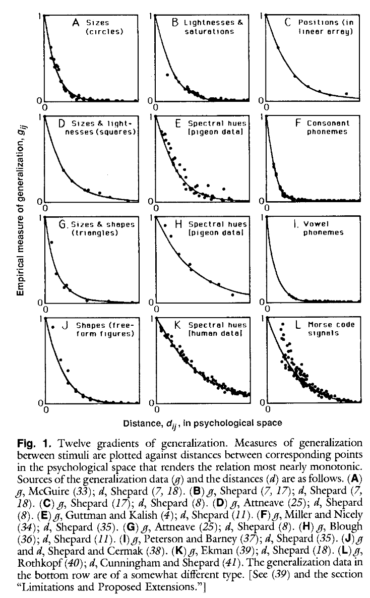

```{r setup, include = FALSE}
library("papaja")
```

```{r analysis-preferences}
# Seed for random number generation
set.seed(42)
knitr::opts_chunk$set(cache.extra = knitr::rand_seed)
```


In 1987 Roger Shepard published a short paper in *Science* with the ambitious title "Toward a Universal Law of Generalization for Psychological Science" [@shepard1987toward]. Drawing on extensive work in the empirical literature on stimulus generalization across many species, he asserted the claim that the form of any stimulus generalization function shouold be approximately exponential in form, when measured with respect to an appropriately formulated stimulus representation. His paper begins with the following remark:

> The tercentenary of the publication, in 1687, of Newton's *Principia* prompts the question of whether psychological science has any hope of achieving a law that is comparable in generality (if not in predictive accuracy) to Newton's universal law of gravitation. Exploring the direction that currently seems most favorable for an affirmative answer, I outline empirical evidence an a theoretical rationale in support of a tentative candidate for a universal law of generalization

Shepard's claim in the original paper was remarkable in scope. He drew on data from several terrestrial species (e.g., humans, pigeons, rats) and across many stimulus domains (e.g., visual, auditory), data that had hitherto been considered unrelated. To spot the connection between these data, Shepard used statistical insights from the similarity modelling literature. He noted that the apparent noninvariance of observed stimulus generalisation functions stemmed largely from the fact that response data were previously analysed with respect to the physical dissimilarities of the stimulus. When the same responses were replotted as a function of distance in a psychological space contructed by multidimensional scaling, he found that the form of the stimulus generalisation was remarkably regular in shape, as shown on the left side of Figure 1.

<!-- ```{r shepard_figure1, echo=FALSE} -->
<!--  -->
<!-- ``` -->

Taken by itself Shepard's empirical discovery would have been impressive. However, not content merely to discover the underlying invariance and thereby unify several distinct strands of research, Shepard went on to provide a theoretical explanation for *why* we should expect to find this invariance. The theory was surprisingly simple: the learner presumes there exists some unknown *consequential* region of the stimulus space across which roughly the same properties hold (e.g., things that look like apples will probably taste the same as one another). Encountering a single stimulus that entails a particular consequence, the learner's task is to infer the location, shape and size of the consequential region itself. Naturally this is an underconstrained problem, as there are an infinite number of possible regions that might correspond to the true consequential region. Nevertheless, Shepard showed that under a quite range of prior assumptions that the learner makes about the nature of consequential regions, the shape of the *generalization* function across the stimulus space ends up approximately exponential, shown on the right side of Figure 1.

(ref:shepard-caption) Two of the figures from Shepard's (1987) paper on stimulus generalisation. On the left, his Fig 1 shows the empirical evidence for an exponential law and on the right his Fig 3 outlines his theoretical claim. [Note: higher resolution versions will be provided in the final version and permission will be obtained to reproduce the originals]
```{r, echo=FALSE, fig.cap = "(ref:shepard-caption)"}
knitr::include_graphics("shepard.jpg",dpi = 150)
```


## Conclusion

To return to Shepard's original paper

> Undoubtably, psychological science had lagged by behind physical science by at least 300 years. Undoubtedly, too, prediction of behavior can never attain the precision for animate that it has for celestial bodies. Yet, psychology may not be inherently limited merely to the descriptive characterization of the behaviors of particular terrestrial species. Possibly, behind the diverse behaviors of humans and animals, as behind the various motions of planets and stars, we may discern the operation of universal laws


# References
```{r create_r-references}
r_refs(file = "r-references.bib")
```

\begingroup
\setlength{\parindent}{-0.5in}
\setlength{\leftskip}{0.5in}

<div id = "refs"></div>
\endgroup
